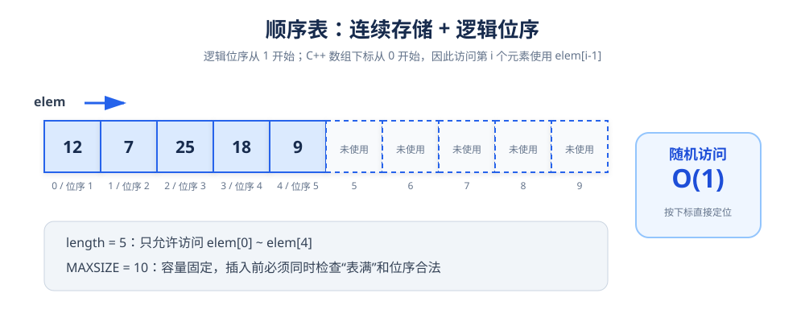
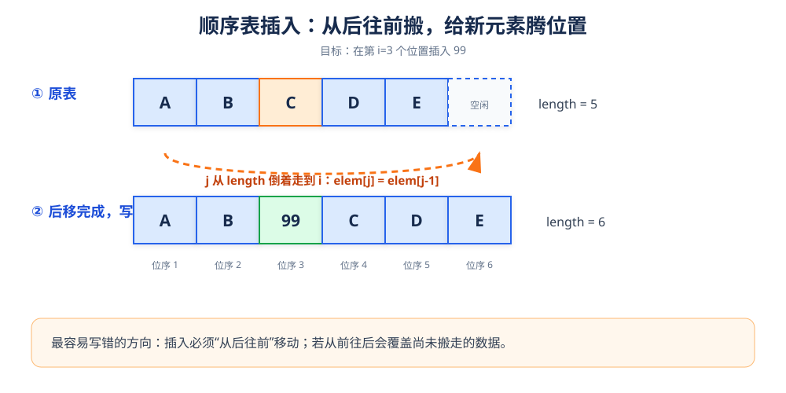
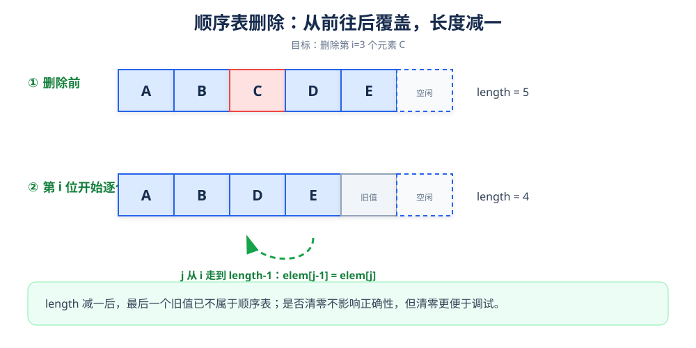

# 顺序表：连续存储的线性表

> **一句话理解**：顺序表把元素放在一段连续的存储空间中，知道首地址和下标，就能直接算出元素地址。

## 1. 结构定义



```cpp
#define MAXSIZE 100

using ElemType = int;

struct SqList {
    ElemType* elem;  // 动态数组的首地址
    int length;      // 当前元素个数
};
```

| 术语 | 含义 |
|---|---|
| `elem` | 连续数组的首地址 |
| `length` | 当前有效元素个数 |
| `MAXSIZE` | 数组最大容量 |
| 位序 `i` | 从 1 开始 |
| 下标 `i - 1` | C++ 数组下标从 0 开始 |

**关键关系**

```text
第 i 个元素的地址 = elem + (i - 1) * sizeof(ElemType)
```

因此，按位取值的时间复杂度为 `O(1)`。

## 2. 初始化与销毁

```cpp
#include <new>

bool InitList(SqList& L) {
    L.elem = new (nothrow) ElemType[MAXSIZE];
    if (L.elem == nullptr) {
        L.length = 0;
        return false;
    }
    L.length = 0;
    return true;
}

void DestroyList(SqList& L) {
    delete[] L.elem;
    L.elem = nullptr;
    L.length = 0;
}
```

> **注意**：`new` 与 `delete[]` 必须成对出现。顺序表使用动态数组，因此销毁时要用 `delete[]`。

## 3. 按位取值

### 目标

读取第 `i` 个元素，并通过引用参数 `e` 返回。

### 过程

1. 检查 `i` 是否位于 `[1, length]`。
2. 直接访问 `elem[i - 1]`。
3. 返回成功或失败。

```cpp
bool GetElem(const SqList& L, int i, ElemType& e) {
    if (i < 1 || i > L.length) {
        return false;
    }
    e = L.elem[i - 1];
    return true;
}
```

**边界检查表**

| 输入 | 结果 |
|---|---|
| `i = 1` | 合法，访问 `elem[0]` |
| `i = length` | 合法，访问最后一个元素 |
| `i = 0` | 非法 |
| `i = length + 1` | 非法 |

## 4. 按值查找

```cpp
int LocateElem(const SqList& L, ElemType e) {
    for (int i = 0; i < L.length; ++i) {
        if (L.elem[i] == e) {
            return i + 1;  // 返回位序
        }
    }
    return 0;  // 0 表示未找到
}
```

| 情况 | 时间复杂度 |
|---|---|
| 最好：第一个元素就是目标值 | `O(1)` |
| 最坏：目标在末尾或不存在 | `O(n)` |
| 平均 | `O(n)` |

## 5. 插入：先搬空位置，再写新值



### 操作目标

在逻辑位序 `i` 处插入元素 `e`，原有元素保持相对顺序。

### 正确步骤

1. 检查表是否已满。
2. 检查插入位置是否满足 `1 <= i <= length + 1`。
3. **从后往前**移动元素：`elem[j] = elem[j - 1]`。
4. 写入 `elem[i - 1] = e`。
5. `length++`。

```cpp
bool ListInsert(SqList& L, int i, ElemType e) {
    if (L.length >= MAXSIZE) {
        return false;
    }
    if (i < 1 || i > L.length + 1) {
        return false;
    }

    for (int j = L.length; j >= i; --j) {
        L.elem[j] = L.elem[j - 1];
    }

    L.elem[i - 1] = e;
    ++L.length;
    return true;
}
```

> **为什么必须从后往前？** 如果从前往后移动，前一个位置的旧值会被覆盖，后面的元素就丢失了。

### 插入复杂度

| 插入位置 | 移动元素个数 | 时间复杂度 |
|---|---:|---:|
| 表头 | `n` | `O(n)` |
| 表尾 | `0` | `O(1)` |
| 平均 | `n / 2` | `O(n)` |

## 6. 删除：用后继元素向前覆盖



```cpp
bool ListDelete(SqList& L, int i, ElemType& e) {
    if (i < 1 || i > L.length) {
        return false;
    }

    e = L.elem[i - 1];

    for (int j = i; j < L.length; ++j) {
        L.elem[j - 1] = L.elem[j];
    }

    --L.length;
    return true;
}
```

### 删除复杂度

删除表头元素需要移动 `n - 1` 个元素；删除表尾元素不需要移动元素。

```text
平均移动次数 = (n - 1) / 2
时间复杂度 = O(n)
```

## 7. 打印顺序表

```cpp
#include <iostream>

void PrintList(const SqList& L) {
    cout << "顺序表元素：";
    for (int i = 0; i < L.length; ++i) {
        cout << L.elem[i] << ' ';
    }
    cout << "  当前长度=" << L.length << '\n';
}
```

## 8. 完整调试代码

```cpp
#include <iostream>
#include <new>

using namespace std;

#define MAXSIZE 100
using ElemType = int;

struct SqList {
    ElemType* elem;
    int length;
};

bool InitList(SqList& L) {
    L.elem = new (nothrow) ElemType[MAXSIZE];
    if (!L.elem) {
        L.length = 0;
        return false;
    }
    L.length = 0;
    return true;
}

void DestroyList(SqList& L) {
    delete[] L.elem;
    L.elem = nullptr;
    L.length = 0;
}

bool GetElem(const SqList& L, int i, ElemType& e) {
    if (i < 1 || i > L.length) return false;
    e = L.elem[i - 1];
    return true;
}

int LocateElem(const SqList& L, ElemType e) {
    for (int i = 0; i < L.length; ++i) {
        if (L.elem[i] == e) return i + 1;
    }
    return 0;
}

bool ListInsert(SqList& L, int i, ElemType e) {
    if (L.length >= MAXSIZE) return false;
    if (i < 1 || i > L.length + 1) return false;

    for (int j = L.length; j >= i; --j) {
        L.elem[j] = L.elem[j - 1];
    }
    L.elem[i - 1] = e;
    ++L.length;
    return true;
}

bool ListDelete(SqList& L, int i, ElemType& e) {
    if (i < 1 || i > L.length) return false;

    e = L.elem[i - 1];
    for (int j = i; j < L.length; ++j) {
        L.elem[j - 1] = L.elem[j];
    }
    --L.length;
    return true;
}

void PrintList(const SqList& L) {
    cout << "顺序表元素：";
    for (int i = 0; i < L.length; ++i) {
        cout << L.elem[i] << ' ';
    }
    cout << "  length=" << L.length << '\n';
}

int main() {
    SqList L;
    if (!InitList(L)) return 1;

    ListInsert(L, 1, 10);
    ListInsert(L, 2, 20);
    ListInsert(L, 3, 30);
    ListInsert(L, 2, 15);
    PrintList(L);  // 10 15 20 30

    ElemType deleted{};
    if (ListDelete(L, 3, deleted)) {
        cout << "删除的元素：" << deleted << '\n';
    }
    PrintList(L);  // 10 15 30

    DestroyList(L);
    return 0;
}
```

## 9. 易错点清单

- 位序从 1 开始，数组下标从 0 开始，二者要统一。
- 插入位置允许 `length + 1`，删除位置不允许。
- 插入从后往前移动，删除从前往后覆盖。
- 修改 `length` 的时机必须在移动和写入完成后。
- 动态分配的数组要用 `delete[]` 释放。