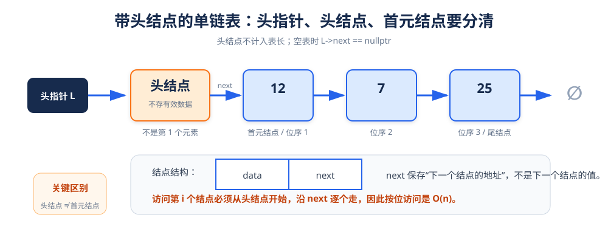
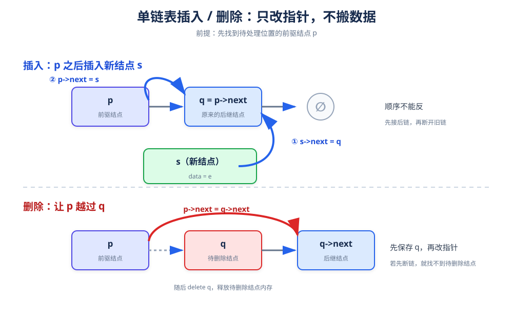
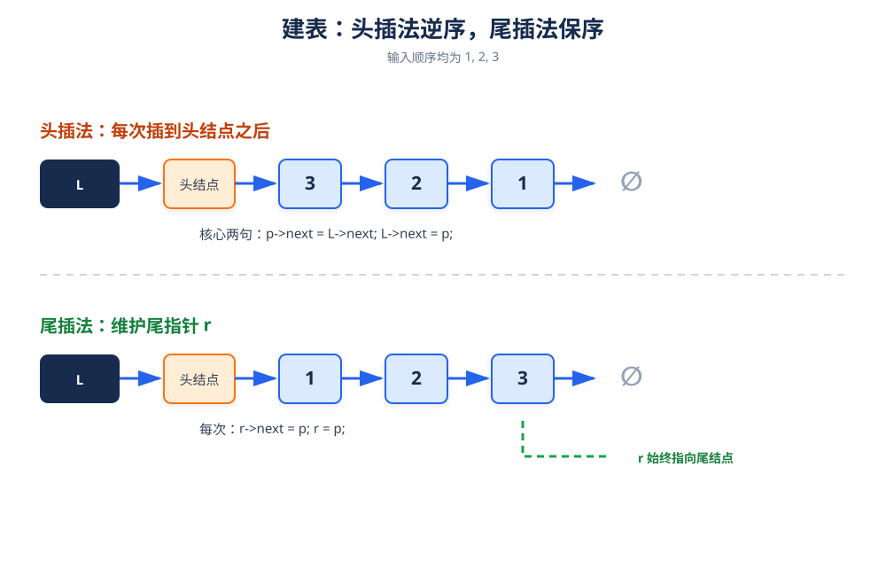

# 单链表：用指针把分散结点串成线性序列

> **一句话理解**：单链表不要求结点连续存放，每个结点通过 `next` 指针记录后继结点的地址。

## 1. 基本结构



```cpp
typedef ElemType int;
typedef struct LNode {
    ElemType data;
    struct LNode* next;
} LNode,*Linklist;
```

> **三个概念要分清**
>
> - 头指针 L：指向头结点的指针。
> - 头结点：位于首元结点之前，不保存有效数据；可以统一插入、删除的写法。
> - 首元结点：保存第 1 个有效数据的结点。

## 2. 初始化、判空与销毁

```cpp
bool InitList(LinkList& L) {
    L = new LNode;
    L->next = nullptr;
    return true;
}

bool ListEmpty(LinkList L) {
    return L->next == nullptr;
}

void DestroyList(LinkList& L) {
    LNode* p = L;
    while (p != nullptr) {
        LNode* next = p->next;
        delete p;
        p = next;
    }
    L = nullptr;  // 整个链表都被释放
}
```

ClearList 与 DestroyList 的区别：

| 操作 | 头结点 | 数据结点 | 操作后能否继续使用 |
|---|---|---|---|
| ClearList| 保留 | 全部释放 | 可以，是空表 |
| DestroyList | 释放 | 全部释放 | 不可以，需重新初始化 |

```cpp
void ClearList(LinkList L) {
    LNode* p = L->next;
    while (p != nullptr) {
        LNode* next = p->next;
        delete p;
        p = next;
    }
    L->next = nullptr;
}
```

## 3. 求表长与按位取值

### 求表长

原稿中最严重的问题是循环缺少花括号，指针不前进会导致死循环。正确写法如下：

```cpp
int ListLength(LinkList L) {
    int count = 0;
    for (LNode* p = L->next; p != nullptr; p = p->next) {
        ++count;
    }
    return count;
}
```

### 按位取值

```cpp
bool GetElem(LinkList L, int i, ElemType& e) {
    if (i < 1) {
        return false;
    }

    LNode* p = L->next;
    int j = 1;

    while (p != nullptr && j < i) {
        p = p->next;
        ++j;
    }

    if (p == nullptr) {
        return false;
    }

    e = p->data;
    return true;
}
```

> 按位访问无法通过地址计算直接定位，必须从头结点开始沿着 next 走，因此时间复杂度为 O(n)。

## 4. 按值查找

```cpp
LNode* LocateElem(LinkList L, ElemType e) {
    for (LNode* p = L->next; p != nullptr; p = p->next) {
        if (p->data == e) {
            return p;
        }
    }
    return nullptr;
}
```

原稿在未找到时继续解引用 nullptr，这是不安全写法。返回 nullptr 更清晰，调用者必须先判断结果。

## 5. 插入：先接后继，再改前驱



### 目标

在第 i 个位置之前插入新元素 e，也就是把新结点接到第 i - 1 个结点之后。

```cpp
bool ListInsert(LinkList& L, int i, ElemType e) {
    if (i < 1) {
        return false;
    }

    LNode* p = L;
    int j = 0;

    while (p != nullptr && j < i - 1) {
        p = p->next;
        ++j;
    }

    if (p == nullptr) {
        return false;
    }

    LNode* s = new LNode;
    s->data = e;
    s->next = p->next;  // ① 新结点接住原后继
    p->next = s;        // ② 前驱结点接住新结点
    return true;
}
```

> **指针顺序不能反**。如果先写 p->next = s，原来的后继地址会丢失，新结点就无法接回原链。

## 6. 删除：先记住待删结点，再让它前驱越过它

```cpp
bool ListDelete(LinkList& L, int i, ElemType& e) {
    if (i < 1) {
        return false;
    }

    LNode* p = L;
    int j = 0;

    while (p->next != nullptr && j < i - 1) {
        p = p->next;
        ++j;
    }

    if (p->next == nullptr) {
        return false;
    }

    LNode* q = p->next;  // q 指向待删除结点
    e = q->data;
    p->next = q->next;   // 让 p 越过 q
    delete q;
    return true;
}
```

## 7. 建表：头插法逆序，尾插法保序



### 头插法

每次都把新结点插到头结点之后，因此输入顺序与链表顺序相反。

```cpp
void CreateList_H(LinkList& L, int n) {
    InitList(L);
    for (int i = 0; i < n; ++i) {
        LNode* p = new LNode;
        cin >> p->data;
        p->next = L->next;
        L->next = p;
    }
}
```

### 尾插法

使用尾指针 r 指向当前链表最后一个结点，输入顺序就是链表顺序。

```cpp
void CreateList_R(LinkList& L, int n) {
    InitList(L);
    LNode* r = L;

    for (int i = 0; i < n; ++i) {
        LNode* p = new LNode;
        cin >> p->data;
        p->next = nullptr;
        r->next = p;
        r = p;
    }
}
```

## 8. 打印与完整测试

```cpp
#include <iostream>

using namespace std;

void PrintList(LinkList L) {
    for (LNode* p = L->next; p != nullptr; p = p->next) {
        cout << p->data << ' ';
    }
    cout << '\n';
}

int main() {
    LinkList L;
    InitList(L);
    CreateList_R(L, 5);   // 按输入顺序生成链表
    PrintList(L);

    ListInsert(L, 1, 11);
    ListInsert(L, 2, 22);
    ListInsert(L, 3, 33);
    PrintList(L);

    ElemType deleted{};
    if (ListDelete(L, 4, deleted)) {
        cout << "删除：" << deleted << '\n';
    }
    PrintList(L);

    ElemType found{};
    if (GetElem(L, 2, found)) {
        cout << "第 2 个结点数据域：" << found << '\n';
    }

    LNode* node = LocateElem(L, 50);
    if (node != nullptr) {
        cout << "找到了：" << node->data << '\n';
    }

    DestroyList(L);
    return 0;
}
```

## 9. 复杂度总览

| 操作 | 时间复杂度 | 说明 |
|---|---:|---|
| 求表长 | `O(n)` | 只能沿指针遍历 |
| 按位取值 | `O(n)` | 从头找到第 `i` 个结点 |
| 按值查找 | `O(n)` | 顺序扫描 |
| 已知前驱时插入 | `O(1)` | 只改两条 `next` |
| 按位插入 | `O(n)` | 查找前驱是主要成本 |
| 已知前驱时删除 | `O(1)` | 改指针并释放结点 |

## 10. 易错点清单

- `while (L)` 与 `while (L->next)` 的判断对象不同，必须先确定要找前驱还是当前结点。
- 修改指针时，先保存会丢失的地址。
- 删除结点后必须 `delete`，否则产生内存泄漏。
- 按值查找未命中时要返回 `nullptr`，不能继续解引用。
- 头结点不算表长，`L->next` 才是首元结点。
