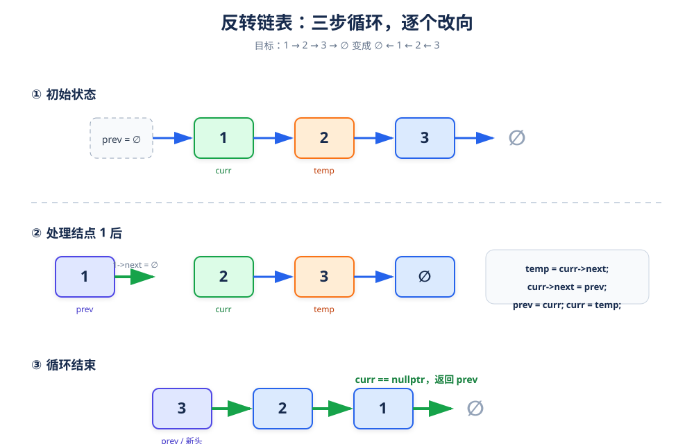

# 反转链表

> **题目**：给定单链表的头结点 `head`，反转链表并返回新的头结点。

| 输入 | 输出 |
|---|---|
| `1 → 2 → 3 → 4 → 5 → nullptr` | `5 → 4 → 3 → 2 → 1 → nullptr` |

## 1. 核心思路

顺序遍历原链表，把每个结点的 `next` 从“指向后继”改成“指向前驱”。

为了完成这件事，需要三个指针：

| 指针 | 含义 |
|---|---|
| `prev` | 已经反转部分的头结点 |
| `curr` | 当前正在处理的结点 |
| `next` | 保存 `curr` 原来的后继，防止改向后断链 |



## 2. 单步操作

```text
next = curr->next;
curr->next = prev;
prev = curr;
curr = next;
```

### 例子：处理结点 1

```text
反转前：nullptr ← prev    curr(1) → 2 → 3 → nullptr

保存后继：next = 2
修改方向：1 → nullptr
移动指针：prev = 1，curr = 2

反转后：nullptr ← 1 ← prev    curr(2) → 3 → nullptr
```

> **必须先保存 `next`**。如果先执行 `curr->next = prev`，原来指向 2 的地址就丢失了，后续链表无法继续访问。

## 3. 循环过程

| 步骤 | `prev` | `curr` | `next` | 链表状态 |
|---|---:|---:|---:|---|
| 初始 | `nullptr` | 1 | 2 | `1→2→3→4→5` |
| 处理 1 后 | 1 | 2 | 3 | `nullptr←1  2→3→4→5` |
| 处理 2 后 | 2 | 3 | 4 | `nullptr←1←2  3→4→5` |
| 处理 3 后 | 3 | 4 | 5 | `nullptr←1←2←3  4→5` |
| 处理 4 后 | 4 | 5 | `nullptr` | `nullptr←1←2←3←4  5` |
| 处理 5 后 | 5 | `nullptr` | — | `nullptr←1←2←3←4←5` |

循环结束时 `curr == nullptr`，`prev` 正好指向反转后的头结点。

## 4. 参考代码

```cpp
struct ListNode {
    int val;
    ListNode* next;
    explicit ListNode(int x) : val(x), next(nullptr) {}
};

class Solution {
public:
    ListNode* reverseList(ListNode* head) {
        ListNode* prev = nullptr;
        ListNode* curr = head;

        while (curr != nullptr) {
            ListNode* next = curr->next;
            curr->next = prev;
            prev = curr;
            curr = next;
        }

        return prev;
    }
};
```

## 5. 正确性说明

可以维护如下循环不变式：

- `prev` 指向已经处理完的前缀，并且该前缀已经被正确反转。
- `curr` 指向尚未处理的第一个结点。
- `next` 暂时保存 `curr` 原来的后继。

每轮把 `curr` 接到 `prev` 前面，再向右推进一格，因此已反转前缀恰好增加一个结点。循环结束时未处理部分为空，整个链表都已反转。

## 6. 复杂度

| 指标 | 结果 | 原因 |
|---|---:|---|
| 时间复杂度 | `O(n)` | 每个结点只处理一次 |
| 空间复杂度 | `O(1)` | 只使用固定数量的指针 |

## 7. 易错点

- 忘记保存 `curr->next`，改向后丢失剩余链表。
- 循环结束后返回 `curr`；此时 `curr` 是 `nullptr`，应该返回 `prev`。
- 空链表直接返回 `nullptr`，代码中的循环天然支持这个边界。
- 只交换结点中的值不算真正的链表反转，面试中通常要求修改指针。