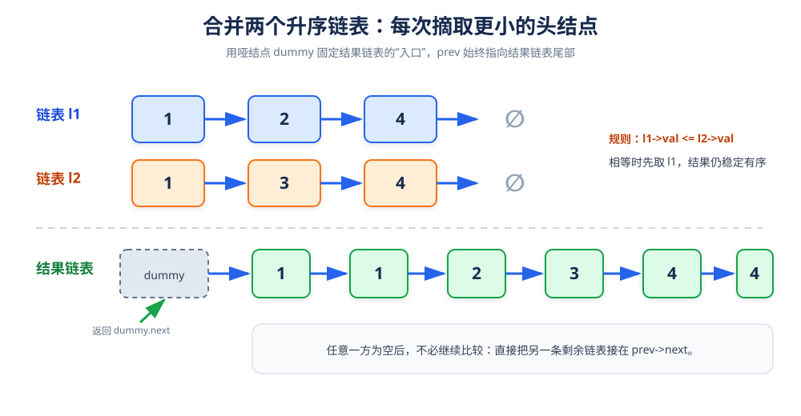

# 合并两个有序链表

> **题目**：将两个升序链表 `l1`、`l2` 合并为一个新的升序链表，并返回结果头结点。

| 输入 | 输出 |
|---|---|
| `l1 = [1,2,4]`，`l2 = [1,3,4]` | `[1,1,2,3,4,4]` |

## 1. 核心思路

每次只比较两条链表当前的第一个结点：

- 谁的值更小，就把谁接到结果链表尾部。
- 若相等，先取 `l1`，可以保持稳定顺序。
- 某一条链表走完后，直接把另一条剩余部分接到结果尾部。



## 2. 核心变量

| 变量 | 作用 |
|---|---|
| `dummy` | 哑结点，固定结果链表的入口 |
| `prev` | 结果链表最后一个结点 |
| `l1` | 第一条链表当前未合并结点 |
| `l2` | 第二条链表当前未合并结点 |

使用哑结点的好处：不需要单独判断“结果链表的第一个结点是谁”。

## 3. 过程演示

```text
l1：1 → 2 → 4
l2：1 → 3 → 4

比较 1 和 1，先取 l1 的 1
结果：dummy → 1

比较 2 和 1，取 l2 的 1
结果：dummy → 1 → 1

比较 2 和 3，取 l1 的 2
结果：dummy → 1 → 1 → 2

比较 4 和 3，取 l2 的 3
结果：dummy → 1 → 1 → 2 → 3

l2 还剩 4，接到结果尾部
结果：dummy → 1 → 1 → 2 → 3 → 4

l1 还剩 4，接到结果尾部
结果：dummy → 1 → 1 → 2 → 3 → 4 → 4
```

## 4. 参考代码

```cpp
struct ListNode {
    int val;
    ListNode* next;
    explicit ListNode(int x) : val(x), next(nullptr) {}
};

class Solution {
public:
    ListNode* mergeTwoLists(ListNode* l1, ListNode* l2) {
        ListNode dummy(-1);
        ListNode* prev = &dummy;

        while (l1 != nullptr && l2 != nullptr) {
            if (l1->val <= l2->val) {
                prev->next = l1;
                l1 = l1->next;
            } else {
                prev->next = l2;
                l2 = l2->next;
            }
            prev = prev->next;
        }

        prev->next = (l1 != nullptr) ? l1 : l2;
        return dummy.next;
    }
};
```

> 这里使用栈上的 `dummy`，函数返回时自动释放，不产生额外结点泄漏。

## 5. 为什么剩余部分可以直接接上

两条输入链表都是升序的。循环结束时，已经合并的所有结点都不会大于任一条剩余链表中的最小值，因此剩余链表本身仍然有序，可以直接整体接在 `prev->next`。

## 6. 正确性说明

把每次选取的结点视为结果链表的下一个元素。因为当前两个头结点分别是两条链表中剩余部分的最小值，所以二者中的较小值必然是全局剩余元素的最小值。重复这一选择，最终结果必然升序。

## 7. 复杂度

设 `m`、`n` 分别为两条链表长度：

| 指标 | 结果 | 原因 |
|---|---:|---|
| 时间复杂度 | `O(m + n)` | 每个结点最多被访问一次 |
| 空间复杂度 | `O(1)` | 复用原结点，只使用固定指针 |

## 8. 易错点

- `while` 条件必须是 `l1 != nullptr && l2 != nullptr`，不能写成 `||`。
- 取完结点后要推进对应指针，否则会死循环。
- 循环结束后不要忘记接上非空剩余链表。
- 若要求稳定合并，相等时应优先取第一条链表。