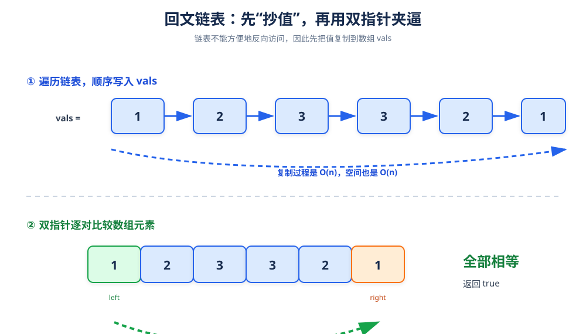

# 回文链表

> **题目**：判断链表从前往后读和从后往前读是否完全相同。

| 输入 | 输出 |
|---|---|
| `[1,2,3,3,2,1]` | `true` |
| `[1,2]` | `false` |
| `[]` | `true` |

## 1. 为什么不能直接双指针

数组可以随机访问，因此可以用 `left`、`right` 从两端向中间夹逼。

单链表只能向后走，无法用 `O(1)` 时间直接取得倒数第 `k` 个结点，所以一个直观做法是：

1. 先遍历链表，把所有值按顺序复制到数组。
2. 再在数组上使用双指针判断回文。



## 2. 算法步骤

### 第一步：复制值

```text
链表：1 → 2 → 3 → 3 → 2 → 1

vals：1, 2, 3, 3, 2, 1
```

### 第二步：双指针夹逼

```text
left = 0，right = 5：比较 1 和 1，相等

left = 1，right = 4：比较 2 和 2，相等

left = 2，right = 3：比较 3 和 3，相等

left >= right：全部检查完毕，返回 true
```

只要出现 `vals[left] != vals[right]`，立刻返回 `false`。

## 3. 参考代码

```cpp
#include <vector>

struct ListNode {
    int val;
    ListNode* next;
    explicit ListNode(int x) : val(x), next(nullptr) {}
};

class Solution {
public:
    bool isPalindrome(ListNode* head) {
        vector<int> vals;

        for (ListNode* curr = head; curr != nullptr; curr = curr->next) {
            vals.push_back(curr->val);
        }

        int left = 0;
        int right = static_cast<int>(vals.size()) - 1;

        while (left < right) {
            if (vals[left] != vals[right]) {
                return false;
            }
            ++left;
            --right;
        }

        return true;
    }
};
```

## 4. 为什么判断条件写成 `left < right`

- 当元素个数为偶数时，最终 `left > right`。
- 当元素个数为奇数时，最终 `left == right`，中间元素不需要和自己比较。

因此 `left < right` 是标准的夹逼终止条件。

## 5. 正确性说明

复制后的数组与链表元素一一对应，双指针严格按照“第 1 个与倒数第 1 个、第 2 个与倒数第 2 个……”的顺序比较。如果所有对称位置都相等，则链表是回文；任一对不相同，链表就不是回文。

## 6. 复杂度

| 指标 | 结果 | 原因 |
|---|---:|---|
| 时间复杂度 | `O(n)` | 复制一次，比较一次 |
| 空间复杂度 | `O(n)` | 需要保存整个值序列 |

## 7. 进阶提示

如果要求额外空间 `O(1)`，可以使用“快慢指针找到中点 → 反转后半段 → 比较两半 → 恢复后半段”的方法。它代码更长、边界更多，但空间更优。

## 8. 易错点

- 空链表和单结点链表都应该是 `true`，不要漏掉边界。
- `vals.size()` 是无符号类型，直接减 1 可能发生下溢，建议显式转成 `int`。
- 只比较前半段是不够的，必须对称比较。
- 题目要求判断值序列，不要求结点地址相同。