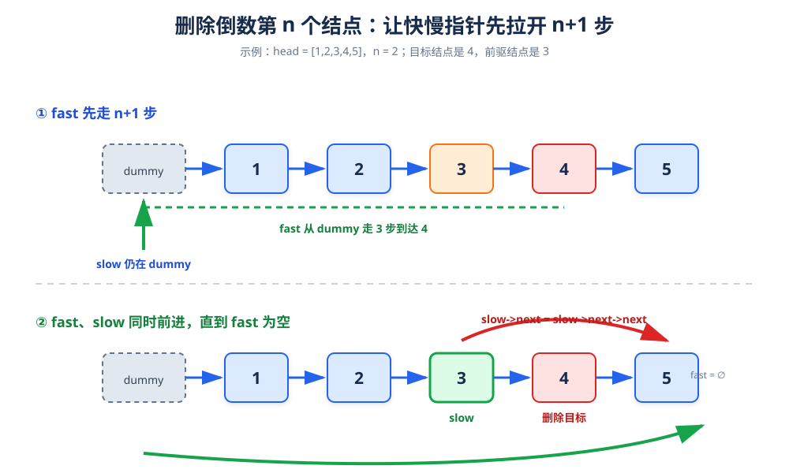

# 删除倒数第 N 个结点

> **题目**：删除单链表中倒数第 `n` 个结点，并返回链表头结点。

| 输入 | 输出 |
|---|---|
| `head = [1,2,3,4,5]`，`n = 2` | `[1,2,3,5]` |
| `head = [1]`，`n = 1` | `[]` |

## 1. 核心思路

如果先用 `fast` 走 `n + 1` 步，再让 `slow` 和 `fast` 同时走，那么当 `fast` 到达 `nullptr` 时：

```text
slow 刚好指向“待删除结点的前驱结点”。
```


图不对，指针从哑结点开始走

使用哑结点 `dummy` 的原因是：当待删除的是头结点时，`slow` 仍然可以停在 `dummy`，不需要单独讨论头结点。

## 2. 为什么是 `n + 1` 步

假设链表长度是 `L`，待删除结点的位序是 `L - n + 1`，它的前驱位序是 `L - n`。

`fast` 先多走 `n + 1` 步后，`slow` 与 `fast` 之间保持固定的 `n + 1` 个指针跨度。两者同步走到末尾时，`slow` 正好落在第 `L - n` 个结点，也就是待删除结点的前驱位置。

## 3. 过程演示

`n = 2` 时，先用 `fast` 从 `dummy` 走 3 步：

```text
dummy → 1 → 2 → 3 → 4 → 5 → nullptr
  ↑                ↑
slow             fast
```

随后同步前进：

```text
dummy → 1 → 2 → 3 → 4 → 5 → nullptr
                ↑              ↑
              slow           fast
```

继续到 `fast == nullptr`：

```text
dummy → 1 → 2 → 3 → 4 → 5 → nullptr
                ↑
              slow
```

此时执行：

```cpp
slow->next = slow->next->next;
```

结点 4 被跳过。

## 4. 参考代码

```cpp
struct ListNode {
    int val;
    ListNode* next;
    explicit ListNode(int x) : val(x), next(nullptr) {}
};

class Solution {
public:
    ListNode* removeNthFromEnd(ListNode* head, int n) {
        ListNode dummy(0);
        dummy.next = head;

        ListNode* slow = &dummy;
        ListNode* fast = &dummy;

        // fast 先走 n + 1 步
        for (int i = 0; i < n + 1; ++i) {
            fast = fast->next;
        }

        // 两者同步走，直到 fast 到达链表末尾之后
        while (fast != nullptr) {
            slow = slow->next;
            fast = fast->next;
        }

        // 删除 slow 的后继
        ListNode* removed = slow->next;
        slow->next = removed->next;

        // 若题目要求释放内存，可以 delete removed;
        return dummy.next;
    }
};
```

## 5. 另一种做法：先求长度

1. 第一次遍历求出链表长度 `L`。
2. 第二次从头遍历到第 `L - n` 个结点。
3. 跳过它的后继结点。

时间复杂度仍然是 `O(n)`，但需要走链表两遍。快慢指针法只需要走一遍，因此更常用于面试。

## 6. 正确性说明

`fast` 与 `slow` 的初始位置相同。经过第一步后，`fast` 比 `slow` 领先 `n + 1` 个结点。同步前进时这个距离保持不变，所以 `fast` 到空指针时，`slow` 距末尾正好还有 `n + 1` 个位置，即它指向倒数第 `n + 1` 个结点，也就是待删除结点的前驱。

## 7. 复杂度

| 指标 | 结果 | 原因 |
|---|---:|---|
| 时间复杂度 | `O(n)` | 每个指针最多走一遍链表 |
| 空间复杂度 | `O(1)` | 只使用 `dummy`、`slow`、`fast` |

## 8. 易错点

- `fast` 必须先走 `n + 1` 步，不是 `n` 步。
- 使用哑结点可以统一处理删除头结点的情况。
- 删除结点前先保存它，便于释放内存或返回被删值。
- 面试代码通常默认结点由框架管理；如果自行管理内存，要说明是否 `delete`。
