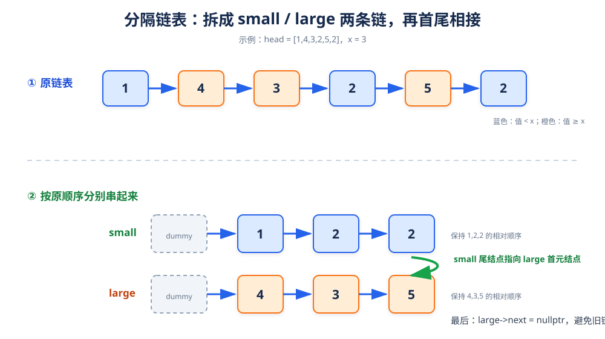

# 分隔链表

> **题目**：给定链表头结点 `head` 和整数 `x`，把小于 `x` 的结点放在大于等于 `x` 的结点之前，并保持两个分区内部原有的相对顺序。

| 输入 | 输出 |
|---|---|
| `head = [1,4,3,2,5,2]`，`x = 3` | `[1,2,2,4,3,5]` |

## 1. 核心思路

同时维护两条临时链表：

| 链表 | 存放内容 |
|---|---|
| `small` | 所有值小于 `x` 的结点 |
| `large` | 所有值大于等于 `x` 的结点 |

遍历原链表时，把当前结点接到对应链表尾部；遍历结束后，把 `small` 的尾结点接到 `large` 的首元结点。



## 2. 为什么要用两个哑结点

如果 `small` 或 `large` 暂时没有结点，直接维护“首结点指针”会产生大量空指针判断。

使用 `smallDummy` 和 `largeDummy` 后：

- `smallDummy.next` 永远是 small 链表真正的头结点。
- `largeDummy.next` 永远是 large 链表真正的头结点。
- 只需维护两个尾指针 `smallTail`、`largeTail`。

## 3. 过程演示

```text
x = 3，原链表：1 → 4 → 3 → 2 → 5 → 2

读到 1：1 < 3，加入 small
small：1
large：空

读到 4：4 >= 3，加入 large
small：1
large：4

读到 3：3 >= 3，加入 large
small：1
large：4 → 3

读到 2：2 < 3，加入 small
small：1 → 2
large：4 → 3

读到 5：5 >= 3，加入 large
small：1 → 2
large：4 → 3 → 5

读到 2：2 < 3，加入 small
small：1 → 2 → 2
large：4 → 3 → 5
```

最后连接：

```text
1 → 2 → 2 → 4 → 3 → 5
```

## 4. 参考代码

```cpp
struct ListNode {
    int val;
    ListNode* next;
    explicit ListNode(int x) : val(x), next(nullptr) {}
};

class Solution {
public:
    ListNode* partition(ListNode* head, int x) {
        ListNode smallDummy(0);
        ListNode largeDummy(0);

        ListNode* smallTail = &smallDummy;
        ListNode* largeTail = &largeDummy;

        while (head != nullptr) {
            ListNode* next = head->next;

            if (head->val < x) {
                smallTail->next = head;
                smallTail = head;
            } else {
                largeTail->next = head;
                largeTail = head;
            }

            head = next;
        }

        // 防止 large 的尾结点仍然指向原链中的某个 small 结点
        largeTail->next = nullptr;

        // small 尾结点接到 large 的首元结点
        smallTail->next = largeDummy.next;

        return smallDummy.next;
    }
};
```

## 5. 为什么最后必须把 `largeTail->next` 置空

代码复用了原链表中的结点。最后一个 large 结点的 `next` 可能仍然指向原链表中的某个 small 结点，如果不切断，连接后可能形成环或把已经分好的元素再次串回来。

## 6. 正确性说明

遍历时按照“小于 `x`”和“大于等于 `x`”分成两组，并保持遇到顺序，因此两组内部相对顺序不变。最后将 small 组整体放在 large 组前面，满足题目要求。

## 7. 复杂度

| 指标 | 结果 | 原因 |
|---|---:|---|
| 时间复杂度 | `O(n)` | 每个结点访问一次 |
| 空间复杂度 | `O(1)` | 复用原结点，只增加固定数量的指针 |

## 8. 易错点

- 条件必须是 `< x`，等于 `x` 的结点属于 large 分区。
- 要保存 `head->next`，因为加入新链后原链会改变。
- 连接前要切断 large 尾结点的旧 `next`。
- 返回 `smallDummy.next`，不要返回 `smallDummy`。