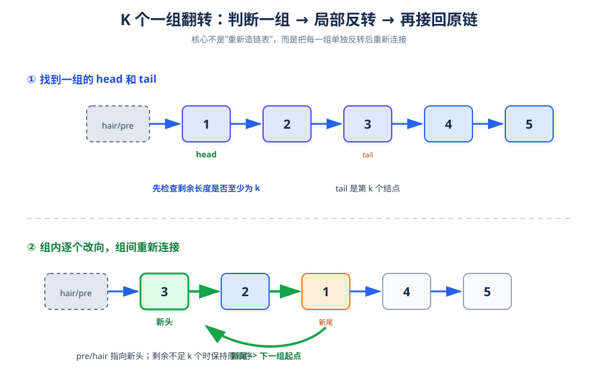

# K 个一组翻转链表

> **题目**：每 `k` 个结点一组进行翻转；如果最后剩余结点不足 `k` 个，则保持原顺序。

| 输入 | 输出 |
|---|---|
| `head = [1,2,3,4,5]`，`k = 2` | `[2,1,4,3,5]` |
| `head = [1,2,3,4,5]`，`k = 3` | `[3,2,1,4,5]` |

## 1. 核心思路

把它拆成三个动作：

1. 从当前位置向后找到第 `k` 个结点 `kth`。
2. 如果找不到 `kth`，说明剩余不足 `k` 个，直接结束。
3. 反转 `[head, kth]` 这一段，并把它重新接到前一组的尾部。



## 2. 核心变量

| 变量 | 含义 |
|---|---|
| `dummy` | 哑结点，统一第一组的处理 |
| `groupPrev` | 当前组的前一个结点 |
| `kth` | 当前组的第 `k` 个结点 |
| `groupNext` | 下一组的起点 |
| `newHead` | 当前组反转后的头结点 |
| `newTail` | 当前组反转后的尾结点 |

对于第一组，`groupPrev` 是 `dummy`；之后的每一组，它是上一组反转后的尾结点。

## 3. 先理解组内反转

假设当前组是：

```text
1 → 2 → 3 → groupNext
```

暂时把 `groupNext` 当作反转后的“尾部外接点”，使用三指针：

```text
prev = groupNext
curr = 1

每一轮：
next = curr->next
curr->next = prev
prev = curr
curr = next
```

最终得到：

```text
groupNext ← 1 ← 2 ← 3
```

新的头是原来的尾结点 `3`，新的尾是原来的头结点 `1`。

## 4. 参考代码

```cpp
#include <utility>

struct ListNode {
    int val;
    ListNode* next;
    explicit ListNode(int x) : val(x), next(nullptr) {}
};

class Solution {
private:
    // 反转 [head, tail]，返回 {新头, 新尾}
    pair<ListNode*, ListNode*> reverseOne(
        ListNode* head, ListNode* tail) {
        ListNode* prev = tail->next;
        ListNode* curr = head;

        while (prev != tail) {
            ListNode* next = curr->next;
            curr->next = prev;
            prev = curr;
            curr = next;
        }

        return {tail, head};
    }

public:
    ListNode* reverseKGroup(ListNode* head, int k) {
        ListNode dummy(0);
        dummy.next = head;
        ListNode* groupPrev = &dummy;

        while (true) {
            // 1. 找到本组第 k 个结点
            ListNode* kth = groupPrev;
            for (int i = 0; i < k; ++i) {
                kth = kth->next;
                if (kth == nullptr) {
                    return dummy.next;
                }
            }

            // 2. 记录下一组起点
            ListNode* groupNext = kth->next;

            // 3. 反转本组
            auto result = reverseOne(groupPrev->next, kth);
            ListNode* newHead = result.first;
            ListNode* newTail = result.second;

            // 4. 重新连接前后组
            groupPrev->next = newHead;
            newTail->next = groupNext;

            // 5. 进入下一组
            groupPrev = newTail;
        }
    }
};
```

## 5. 例子：k = 2

```text
原链表：dummy → 1 → 2 → 3 → 4 → 5

第 1 组：1,2 反转后为 2,1
dummy → 2 → 1 → 3 → 4 → 5
             ↑
          groupPrev

第 2 组：3,4 反转后为 4,3
dummy → 2 → 1 → 4 → 3 → 5

剩余 5 不足 2 个，保持顺序
最终：2 → 1 → 4 → 3 → 5
```

## 6. 例子：k = 3

```text
原链表：1 → 2 → 3 → 4 → 5

第 1 组：1,2,3 反转后为 3,2,1
剩余：4 → 5，不足 3 个，不翻转

最终：3 → 2 → 1 → 4 → 5
```

## 7. 正确性说明

用归纳法理解：

- 第 1 组之前只有 `dummy`，反转后接到 dummy 后面。
- 假设前若干组已经正确反转并接好，则 `groupPrev` 是这些组正确结果的尾结点。
- 当前组长度至少为 `k` 时，`reverseOne` 会正确反转组内所有结点。
- 把 `newTail->next` 接到 `groupNext` 后，完整前缀仍然正确。
- 当剩余结点不足 `k` 个时立即返回，剩余部分未被改动。

因此最终链表满足题目要求。

## 8. 复杂度

| 指标 | 结果 | 原因 |
|---|---:|---|
| 时间复杂度 | `O(n)` | 每个结点最多被检查一次、反转一次 |
| 空间复杂度 | `O(1)` | 迭代实现只使用固定数量指针 |

## 9. 易错点

- 找到 `kth` 之前不能先破坏当前组的链接。
- 不足 `k` 个时必须保持剩余结点原顺序，不能反转。
- 每组反转后要分别连接 `groupPrev -> newHead` 和 `newTail -> groupNext`。
- 下一组从 `newTail->next`，也就是 `groupNext` 开始。
- `k = 1` 时每组长度都是 1，结果应与原链表相同。