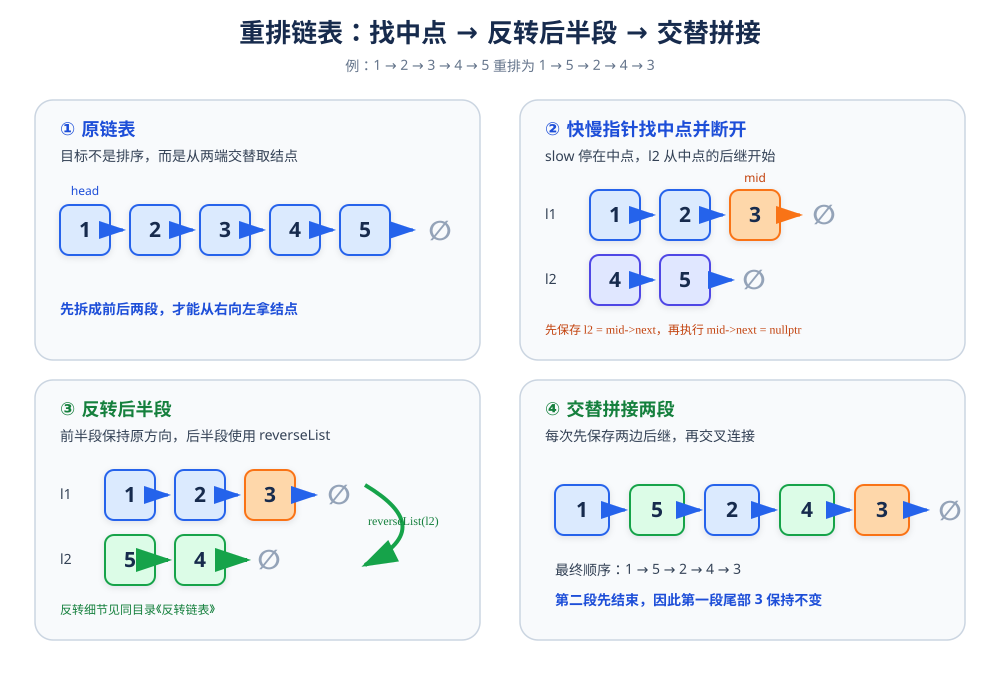

# 重排链表

> **题目**：给定单链表 `head`，按照 `L0 → Ln → L1 → Ln-1 → L2 → Ln-2 → ...` 的顺序重新排列结点。不能只修改结点中的值，必须改变结点之间的连接关系。

| 输入 | 输出 |
|---|---|
| `1 → 2 → 3 → 4 → 5` | `1 → 5 → 2 → 4 → 3` |
| `1 → 2 → 3 → 4` | `1 → 4 → 2 → 3` |

## 1. 核心思路

把整个算法拆成三个基本动作：

1. 用快慢指针找到中间结点，把链表分成前半段 `l1` 和后半段 `l2`。
2. 断开中间结点与后半段的连接，再反转后半段 `l2`。
3. 从前半段和反转后的后半段交替取结点，重新拼接成一条链表。

其中“反转后半段”直接复用 [反转链表](01_反转链表.md) 中的三指针方法。



以 `1 → 2 → 3 → 4 → 5` 为例：

```text
原链表：      1 → 2 → 3 → 4 → 5
分割后：      l1 = 1 → 2 → 3
              l2 = 4 → 5
反转后半段：  l2 = 5 → 4
交替拼接后：  1 → 5 → 2 → 4 → 3
```

## 2. 查找中间结点（快慢指针）

快指针 `fast` 每次走两步，慢指针 `slow` 每次走一步。

```cpp
ListNode* middleNode(ListNode* head) {
    ListNode* slow = head;
    ListNode* fast = head;

    while (fast != nullptr && fast->next != nullptr) {
        slow = slow->next;
        fast = fast->next->next;
    }

    return slow;
}
```

循环结束时：

- 结点个数为奇数，`slow` 指向正中间结点。
- 结点个数为偶数，`slow` 指向前半段的最后一个结点。

例如：

```text
1 → 2 → 3 → 4 → 5
        ↑
       slow

1 → 2 → 3 → 4
        ↑
       slow
```

这里的划分方式保证前半段长度不小于后半段，因此交替拼接时后半段会先结束，前半段多出来的尾结点可以直接保留。

## 3. 断开并反转后半段

先保存 `mid->next`，再把 `mid->next` 置为 `nullptr`，链表就被切成了两段：

```cpp
ListNode* mid = middleNode(head);

ListNode* l1 = head;
ListNode* l2 = mid->next;

mid->next = nullptr;
l2 = reverseList(l2);
```

对于：

```text
1 → 2 → 3 → 4 → 5
```

分割并反转后得到：

```text
l1：1 → 2 → 3 → nullptr
l2：5 → 4 → nullptr
```
## 4. 反转链表
反转链表的完整指针变化、循环过程和正确性说明见：[反转链表](01_反转链表.md)。

## 5. 交替拼接

交替拼接的目标是依次执行：

```text
l1 当前结点 → l2 当前结点 → l1 下一个结点 → l2 下一个结点 → ...
```

因为修改 `l1->next` 后会丢失原来的后继，所以每轮都要先保存两个当前结点的后继：

```cpp
void mergeList(ListNode* l1, ListNode* l2) {
    while (l1 != nullptr && l2 != nullptr) {
        ListNode* l1Next = l1->next;
        ListNode* l2Next = l2->next;

        l1->next = l2;
        l2->next = l1Next;

        l1 = l1Next;
        l2 = l2Next;
    }
}
```

### 拼接过程

初始状态：

```text
l1：1 → 2 → 3
l2：5 → 4
```

第 1 轮：

```text
保存：l1Next = 2，l2Next = 4

执行：1 → 5，5 → 2

得到：1 → 5 → 2 → 3    l1 移到 2，l2 移到 4
```

第 2 轮：

```text
保存：l1Next = 3，l2Next = nullptr

执行：2 → 4，4 → 3

得到：1 → 5 → 2 → 4 → 3    l2 变为 nullptr
```

循环结束，最终链表就是 `1 → 5 → 2 → 4 → 3`。

## 5. 参考代码

```cpp
struct ListNode {
    int val;
    ListNode* next;
    explicit ListNode(int x) : val(x), next(nullptr) {}
};

class Solution {
public:
    void reorderList(ListNode* head) {
        if (head == nullptr || head->next == nullptr) {
            return;
        }

        ListNode* mid = middleNode(head);
        ListNode* l1 = head;
        ListNode* l2 = mid->next;

        mid->next = nullptr;
        l2 = reverseList(l2);

        mergeList(l1, l2);
    }

private:
    ListNode* middleNode(ListNode* head) {
        ListNode* slow = head;
        ListNode* fast = head;

        while (fast != nullptr && fast->next != nullptr) {
            slow = slow->next;
            fast = fast->next->next;
        }

        return slow;
    }

    ListNode* reverseList(ListNode* head) {
        ListNode* prev = nullptr;
        ListNode* curr = head;

        while (curr != nullptr) {
            ListNode* next = curr->next;
            curr->next = prev;
            prev = curr;
            curr = next;
        }

        return prev;
    }

    void mergeList(ListNode* l1, ListNode* l2) {
        while (l1 != nullptr && l2 != nullptr) {
            ListNode* l1Next = l1->next;
            ListNode* l2Next = l2->next;

            l1->next = l2;
            l2->next = l1Next;

            l1 = l1Next;
            l2 = l2Next;
        }
    }
};
```

## 6. 正确性说明

1. `middleNode` 让快指针速度是慢指针的两倍，因此慢指针会停在前半段的最后一个结点。
2. 执行 `mid->next = nullptr` 后，链表被准确分成前半段 `l1` 和后半段 `l2`。
3. `reverseList` 将后半段反转，使它可以按照倒序提供结点。
4. `mergeList` 每轮依次连接一个 `l1` 结点和一个 `l2` 结点，并保存两边原来的后继，不会断链。
5. 因为前半段不短于后半段，`l2` 会先变为 `nullptr`；此时前半段剩余结点已经接在结果尾部，无需额外处理。

因此最终链表交替包含原链表前半段和后半段的倒序结点，满足重排要求。

## 7. 复杂度

| 指标 | 结果 | 原因 |
|---|---:|---|
| 时间复杂度 | `O(n)` | 查找中点、反转、拼接都只扫描链表常数次 |
| 空间复杂度 | `O(1)` | 只使用固定数量的指针，递归栈不计入额外空间 |

## 8. 易错点

- 空链表或只有一个结点时直接返回，不能继续访问 `mid->next`。
- 必须先保存 `l2 = mid->next`，再执行 `mid->next = nullptr`，否则后半段起点会丢失。
- 反转后半段可以复用 [反转链表](01_反转链表.md) 的代码，不要重复造一套容易出错的写法。
- 拼接时先保存 `l1Next` 和 `l2Next`，再修改 `next`。
- 连接顺序是 `l1 -> l2 -> l1Next`，不能只交换结点中的值。
- 循环条件是 `l1 != nullptr && l2 != nullptr`；后半段先结束后，前半段剩余部分保持原顺序即可。
