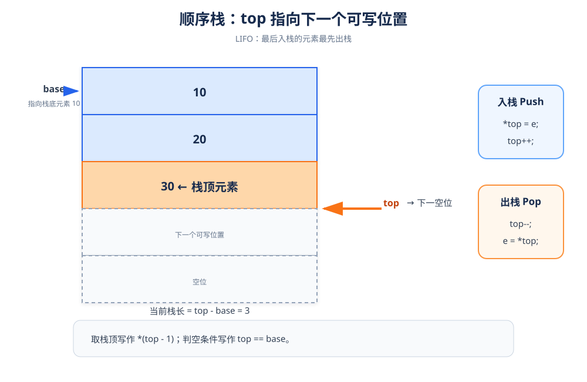

# 顺序栈：用 top 标记栈顶位置

> **一句话理解**：栈是只允许在一端插入和删除的线性表，遵循后进先出（LIFO）。

## 1. 结构定义



```cpp
#define MAXSIZE 100
using SElemType = int;

struct SqStack {
    SElemType* base;  // 栈底地址
    SElemType* top;   // 指向栈顶元素的下一个位置
    int stacksize;    // 当前容量
};
```

### 为什么要约定 `top` 指向“下一个空位”

- 空栈：`top == base`
- 栈满：`top - base == stacksize`
- 入栈：先写入 `*top = e`，再执行 `top++`
- 出栈：先执行 `top--`，再读取 `*top`
- 取栈顶：读取 `*(top - 1)`

## 2. 初始化、判空与销毁

```cpp
#include <new>

bool InitStack(SqStack& s) {
    s.base = new (nothrow) SElemType[MAXSIZE];
    if (s.base == nullptr) {
        s.top = nullptr;
        s.stacksize = 0;
        return false;
    }
    s.top = s.base;
    s.stacksize = MAXSIZE;
    return true;
}

bool StackEmpty(const SqStack& s) {
    return s.top == s.base;
}

void DestroyStack(SqStack& s) {
    delete[] s.base;
    s.base = nullptr;
    s.top = nullptr;
    s.stacksize = 0;
}
```

## 3. 入栈

```cpp
bool Push(SqStack& s, SElemType e) {
    if (s.top - s.base == s.stacksize) {
        return false;  // 栈满
    }

    *s.top = e;
    ++s.top;
    return true;
}
```

### 过程拆解

1. 判断是否已经到达容量上限。
2. 把新元素写到 `top` 指向的空位。
3. `top` 向后移动一格。

> **顺序不能反**：如果先 `top++`，新元素会写到错误的覆盖位。

## 4. 出栈与取栈顶

```cpp
bool Pop(SqStack& s, SElemType& e) {
    if (StackEmpty(s)) {
        return false;
    }

    --s.top;       // 回到最后一个有效元素
    e = *s.top;
    return true;
}

bool GetTop(const SqStack& s, SElemType& e) {
    if (StackEmpty(s)) {
        return false;
    }

    e = *(s.top - 1);
    return true;
}
```

## 5. 求长度

```cpp
int StackLength(const SqStack& s) {
    return static_cast<int>(s.top - s.base);
}
```

指针相减得到的是两个地址之间相差的元素个数，正好就是当前栈长。

## 6. 完整测试

```cpp
#include <iostream>

using namespace std;

int main() {
    SqStack s;
    if (!InitStack(s)) return 1;

    Push(s, 10);
    Push(s, 20);
    Push(s, 30);
    cout << "入栈后长度：" << StackLength(s) << '\n';

    SElemType top{};
    if (GetTop(s, top)) {
        cout << "当前栈顶：" << top << '\n';
    }

    SElemType popped{};
    if (Pop(s, popped)) {
        cout << "出栈元素：" << popped << '\n';
    }
    cout << "出栈后长度：" << StackLength(s) << '\n';

    DestroyStack(s);
    return 0;
}
```

## 7. 复杂度与易错点

| 操作 | 时间复杂度 |
|---|---:|
| 判空 | `O(1)` |
| 入栈 | `O(1)` |
| 出栈 | `O(1)` |
| 取栈顶 | `O(1)` |
| 求长度 | `O(1)` |

- `top` 指向的是栈顶元素的下一个位置，不要直接读取 `*top` 当作栈顶。
- 入栈先写后移，出栈先移后读。
- 销毁时使用 `delete[] base`。
