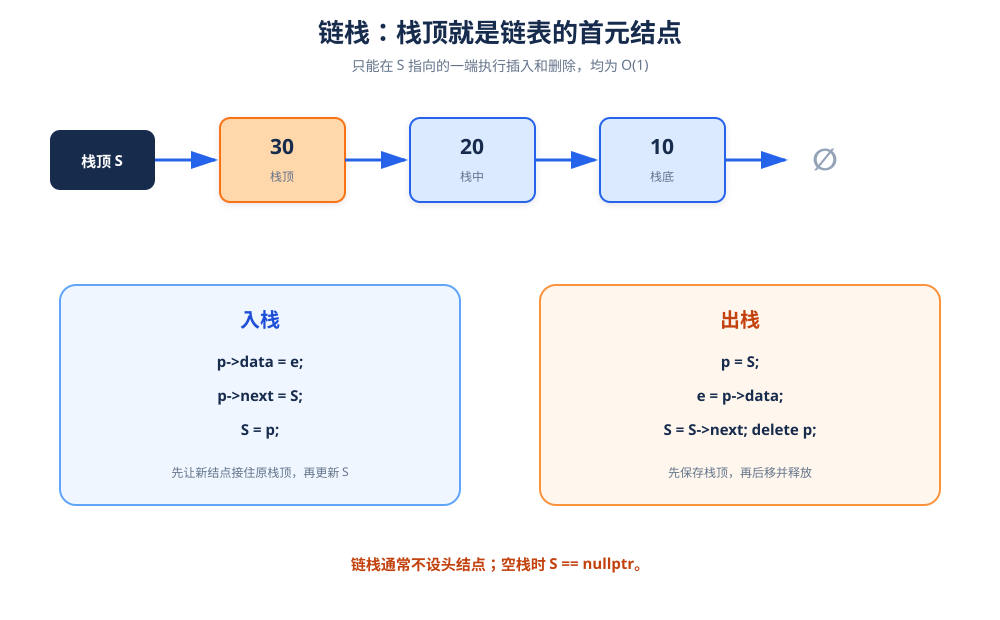

# 链栈：用单链表实现后进先出

> **一句话理解**：链栈把栈顶放在链表头部；入栈和出栈都只操作首元结点，因此不需要头结点也能很方便。

## 1. 结构定义



```cpp
using SElemType = int;

struct StackNode {
    SElemType data;
    StackNode* next;
};

using LinkStack = StackNode*;  // 直接指向栈顶结点
```

- `S == nullptr`：空栈。
- `S` 指向的结点：栈顶。
- `S->next`：栈顶下面的元素。

## 2. 初始化与判空

```cpp
void InitStack(LinkStack& S) {
    S = nullptr;
}

bool StackEmpty(LinkStack S) {
    return S == nullptr;
}
```

> 链栈可以不设置头结点。每次操作只在 `S` 所在的一端进行。

## 3. 入栈

```cpp
bool Push(LinkStack& S, SElemType e) {
    StackNode* p = new StackNode;
    p->data = e;
    p->next = S;  // 新结点接住原栈顶
    S = p;        // 新结点成为新的栈顶
    return true;
}
```

### 图解顺序

```text
原栈顶：S → 20 → 10 → ∅

执行 p->next = S：
p → 20 → 10 → ∅
S → 20 → 10 → ∅   （S 仍指旧栈顶）

执行 S = p：
S → p → 20 → 10 → ∅
```

## 4. 出栈与取栈顶

```cpp
bool Pop(LinkStack& S, SElemType& e) {
    if (StackEmpty(S)) {
        return false;
    }

    StackNode* p = S;  // 保存待删除的栈顶
    e = p->data;
    S = S->next;       // 栈顶指针后移
    delete p;          // 释放原栈顶
    return true;
}

bool GetTop(LinkStack S, SElemType& e) {
    if (StackEmpty(S)) {
        return false;
    }

    e = S->data;
    return true;
}
```

> `GetTop` 只读取，不修改栈顶指针；`Pop` 才会改变 `S`。

## 5. 求长度与销毁

```cpp
int StackLength(LinkStack S) {
    int count = 0;
    for (StackNode* p = S; p != nullptr; p = p->next) {
        ++count;
    }
    return count;
}

void DestroyStack(LinkStack& S) {
    while (S != nullptr) {
        StackNode* p = S;
        S = S->next;
        delete p;
    }
}
```

## 6. 完整测试

```cpp
#include <iostream>

using namespace std;

int main() {
    LinkStack S;
    InitStack(S);

    Push(S, 10);
    Push(S, 20);
    Push(S, 30);
    cout << "当前长度：" << StackLength(S) << '\n';

    SElemType top{};
    if (GetTop(S, top)) {
        cout << "栈顶：" << top << '\n';  // 30
    }

    SElemType popped{};
    if (Pop(S, popped)) {
        cout << "出栈：" << popped << '\n';  // 30
    }

    DestroyStack(S);
    return 0;
}
```

## 7. 复杂度与易错点

| 操作 | 时间复杂度 |
|---|---:|
| 入栈 | `O(1)` |
| 出栈 | `O(1)` |
| 取栈顶 | `O(1)` |
| 求长度 | `O(n)` |

- 链栈的 `S` 是栈顶指针，不是链表头结点的指针。
- 出栈前必须保存 `S`，否则释放后无法找到原栈顶。
- 销毁时不要只置空 `S`，要逐个 `delete` 链上结点。