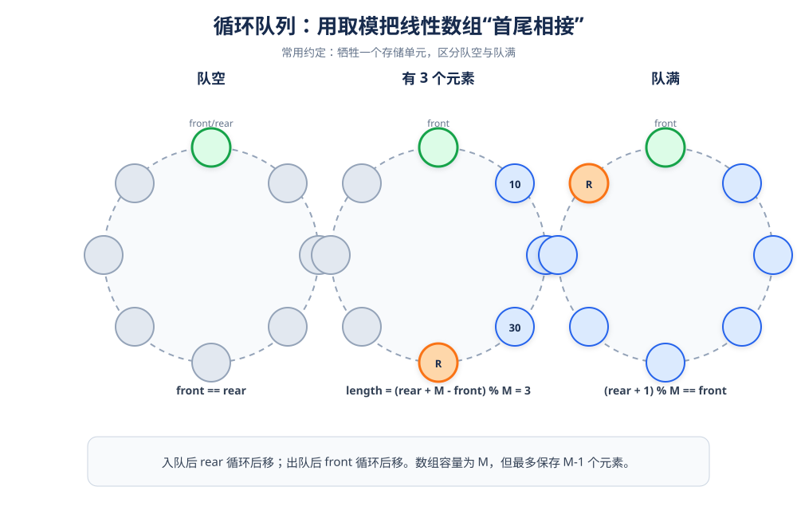

# 顺序队列：用取模构造循环队列

> **一句话理解**：顺序队列使用连续数组，但通过 `(rear + 1) % MAXQSIZE` 让队尾到达数组末尾后回到开头。

## 1. 结构定义



```cpp
#define MAXQSIZE 100
using QElemType = int;

struct SqQueue {
    QElemType* base;  // 连续存储空间
    int front;        // 队头下标：指向当前队头元素
    int rear;         // 队尾下标：指向下一个可写位置
};
```

### 为什么牺牲一个存储单元

若队头等于队尾既可能表示空队，也可能表示队满。为了不额外保存计数器，通常约定：

```text
队空：front == rear
队满：(rear + 1) % MAXQSIZE == front
```

因此数组容量是 `MAXQSIZE`，最多保存 `MAXQSIZE - 1` 个元素。

## 2. 初始化与销毁

```cpp
#include <new>

bool InitQueue(SqQueue& Q) {
    Q.base = new (nothrow) QElemType[MAXQSIZE];
    if (Q.base == nullptr) {
        Q.front = Q.rear = 0;
        return false;
    }

    Q.front = 0;
    Q.rear = 0;
    return true;
}

bool DestroyQueue(SqQueue& Q) {
    delete[] Q.base;
    Q.base = nullptr;
    Q.front = Q.rear = 0;
    return true;
}
```

## 3. 求队列长度

```cpp
int QueueLength(const SqQueue& Q) {
    return (Q.rear + MAXQSIZE - Q.front) % MAXQSIZE;
}
```

公式的含义：先计算 `rear - front`；若 `rear` 已经绕到 `front` 前面，就借助 `+ MAXQSIZE` 把差值转成非负数。

### 示例

| `front` | `rear` | `(rear - front + M) % M` | 长度 |
|---:|---:|---:|---:|
| 0 | 0 | 0 | 0 |
| 0 | 3 | 3 | 3 |
| 8 | 2 | `(2 - 8 + 10) % 10` | 4 |

## 4. 入队

```cpp
bool EnQueue(SqQueue& Q, QElemType e) {
    if ((Q.rear + 1) % MAXQSIZE == Q.front) {
        return false;  // 队满
    }

    Q.base[Q.rear] = e; //这个时候rear指针就是e的位置
    Q.rear = (Q.rear + 1) % MAXQSIZE;
    return true;
}
```

### 步骤

1. 先判断是否队满。
2. 在 `base[rear]` 写入新元素。
3. `rear` 循环后移一格。

> 入队只改变 `rear`，不会改变 `front`。

## 5. 出队与取队头

```cpp
bool DeQueue(SqQueue& Q, QElemType& e) {
    if (Q.front == Q.rear) {
        return false;  // 队空
    }

    e = Q.base[Q.front];
    Q.front = (Q.front + 1) % MAXQSIZE;
    return true;
}

bool GetHead(const SqQueue& Q, QElemType& e) {
    if (Q.front == Q.rear) {
        return false;
    }

    e = Q.base[Q.front];
    return true;
}
```

原稿中 `GetHead` 最后写成了 `return e;`，这会把元素值隐式转换成 `bool`，并不是“返回元素”。本版改为通过引用参数返回，函数只表示成功或失败。

## 6. 完整测试

```cpp
#include <iostream>

using namespace std;

int main() {
    SqQueue Q;
    if (!InitQueue(Q)) return 1;

    EnQueue(Q, 10);
    EnQueue(Q, 20);
    EnQueue(Q, 30);
    cout << "队列长度：" << QueueLength(Q) << '\n';

    QElemType head{};
    if (GetHead(Q, head)) {
        cout << "队头：" << head << '\n';
    }

    QElemType out{};
    if (DeQueue(Q, out)) {
        cout << "出队：" << out << '\n';
    }
    cout << "出队后长度：" << QueueLength(Q) << '\n';

    DestroyQueue(Q);
    return 0;
}
```

## 7. 复杂度与易错点

| 操作 | 时间复杂度 |
|---|---:|
| 入队 | `O(1)` |
| 出队 | `O(1)` |
| 取队头 | `O(1)` |
| 求长度 | `O(1)` |

- `rear` 指向下一个可写位置，不是当前最后一个元素。
- 判断队满必须用 `(rear + 1) % M == front`。
- `front` 和 `rear` 都要使用取模移动，不能只做 `++`。
- 销毁时使用 `delete[] base`。
