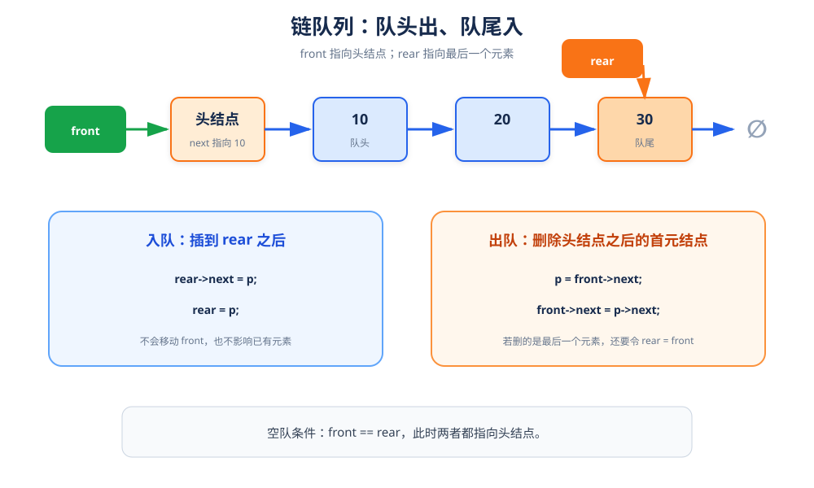

# 链队列：队头删除，队尾插入

> **一句话理解**：链队列用头结点的 `next` 保存队头，用 `rear` 指向最后一个结点；入队和出队都不需要移动数据。

## 1. 结构定义



```cpp
using QElemType = int;

struct QNode {
    QElemType data;
    QNode* next;
};

struct LinkQueue {
    QNode* front;  // 指向头结点
    QNode* rear;   // 指向最后一个元素
};
```

### 空队状态

初始化时创建一个头结点，并令：

```text
front == rear
front->next == nullptr
```

这样就形成了空链队列。

## 2. 初始化、判空与销毁

```cpp
#include <new>

bool InitQueue(LinkQueue& Q) {
    Q.front = Q.rear = new (nothrow) QNode;
    if (Q.front == nullptr) {
        return false;
    }

    Q.front->next = nullptr;
    return true;
}

bool QueueEmpty(const LinkQueue& Q) {
    return Q.front == Q.rear;
}

void DestroyQueue(LinkQueue& Q) {
    while (Q.front != nullptr) {
        QNode* p = Q.front;  //当然也可以让p=Q.front->next,delete Q.front;
        Q.front = Q.front->next;
        delete p;
    }
    Q.rear = nullptr;
}
```

## 3. 求队列长度

```cpp
int QueueLength(const LinkQueue& Q) {
    int count = 0;
    for (QNode* p = Q.front->next; p != nullptr; p = p->next) {
        ++count;
    }
    return count;
}
```

链队列没有保存长度，因此求长度需要遍历；如果频繁使用长度，可以增加 `length` 成员。

## 4. 入队

```cpp
bool EnQueue(LinkQueue& Q, QElemType e) {
    QNode* p = new QNode;
    p->data = e;
    p->next = nullptr;

    Q.rear->next = p;
    Q.rear = p;
    return true;
}
```

### 过程拆解

1. 新建结点 `p`。
2. 让当前队尾的 `next` 指向 `p`。
3. 令 `rear = p`。

> `front` 不移动，所以出队顺序不会被打乱。

## 5. 出队与取队头

```cpp
bool DeQueue(LinkQueue& Q, QElemType& e) {
    if (QueueEmpty(Q)) {
        return false;
    }

    QNode* p = Q.front->next;  // 队头元素
    e = p->data;
    Q.front->next = p->next;

    if (Q.rear == p) {
        Q.rear = Q.front;      // 删除最后一个元素后，队列变空
    }

    delete p;
    return true;
}

bool GetHead(const LinkQueue& Q, QElemType& e) {
    if (QueueEmpty(Q)) {
        return false;
    }

    e = Q.front->next->data;
    return true;
}
```

### 出队时最关键的边界

如果删除的是队列中唯一的元素，那么 `rear` 还指着刚被释放的 `p`，必须立刻令 `Q.rear = Q.front`，否则队列会进入错误状态。

## 6. 完整测试

```cpp
#include <iostream>

using namespace std;

int main() {
    LinkQueue Q;
    if (!InitQueue(Q)) return 1;

    EnQueue(Q, 10);
    EnQueue(Q, 20);
    EnQueue(Q, 30);
    cout << "队列长度：" << QueueLength(Q) << '\n';

    QElemType head{};
    if (GetHead(Q, head)) {
        cout << "队头：" << head << '\n';
    }

    QElemType out{};
    if (DeQueue(Q, out)) {
        cout << "出队：" << out << '\n';
    }

    cout << "出队后长度：" << QueueLength(Q) << '\n';
    DestroyQueue(Q);
    return 0;
}
```

## 7. 复杂度与易错点

| 操作 | 时间复杂度 |
|---|---:|
| 入队 | `O(1)` |
| 出队 | `O(1)` |
| 取队头 | `O(1)` |
| 求长度 | `O(n)` |

- `front` 指向头结点，`front->next` 才是队头元素。
- 队空判断是 `front == rear`。
- 删除唯一元素后必须把 `rear` 拉回头结点。
- 销毁队列时从头结点开始逐个释放。
