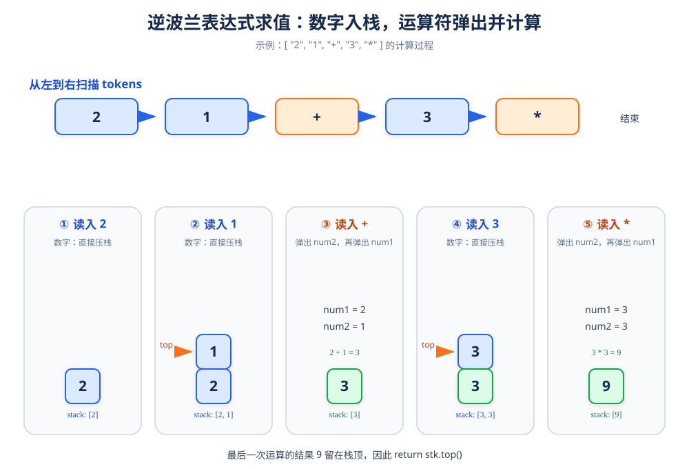

# 逆波兰表达式求值

> **题目**：给定一个用字符串数组表示的逆波兰表达式，计算出表达式的值。逆波兰表达式又称后缀表达式，运算符写在两个操作数之后。

| 输入 | 输出 |
|---|---|
| `["2","1","+","3","*"]` | `9` |
| `["4","13","5","/","+"]` | `6` |

## 1. 什么是逆波兰表达式

普通表达式：

```text
(2 + 1) * 3
```

写成逆波兰表达式：

```text
2 1 + 3 *
```

计算时从左到右扫描：

- 遇到数字，就把它压入栈。
- 遇到运算符，就弹出栈顶的两个数进行计算，再把结果压回栈中。



## 2. 核心算法流程

用下面的循环处理每一个 `token`：

```text
for token in tokens:
    如果 token 是数字：
        压入操作数栈
    否则：
        num2 = 弹出栈顶
        num1 = 弹出栈顶
        计算结果 = num1 op num2
        把计算结果压入栈
返回栈顶元素
```

注意弹出的第一个数是右操作数 `num2`，第二个数才是左操作数 `num1`。减法和除法必须保持 `num1 - num2`、`num1 / num2` 的顺序。

## 3. 示例：`["2","1","+","3","*"]`

| 当前 token | 操作 | 栈中的内容 |
|---|---|---|
| `2` | 数字入栈 | `[2]` |
| `1` | 数字入栈 | `[2, 1]` |
| `+` | 弹出 `num2 = 1`，再弹出 `num1 = 2`，计算 `2 + 1 = 3` | `[3]` |
| `3` | 数字入栈 | `[3, 3]` |
| `*` | 弹出 `num2 = 3`，再弹出 `num1 = 3`，计算 `3 * 3 = 9` | `[9]` |

扫描结束后，栈顶的 `9` 就是答案。

## 4. 运算符处理

```cpp
int num2 = stk.top();
stk.pop();

int num1 = stk.top();
stk.pop();

switch (token[0]) {
    case '+':
        stk.push(num1 + num2);
        break;
    case '-':
        stk.push(num1 - num2);
        break;
    case '*':
        stk.push(num1 * num2);
        break;
    case '/':
        stk.push(num1 / num2);
        break;
}
```

每个 `case` 后面的 `break` 不能省略，否则会发生 `switch` 穿透，连续执行后面的运算并压入错误结果。

题目保证输入是合法的逆波兰表达式，并且除法结果向零截断；C++ 的整数除法正好符合这个要求。

## 5. 参考代码

```cpp
#include <cstdlib>
#include <stack>
#include <string>
#include <vector>
using namespace std;

class Solution {
public:
    int evalRPN(vector<string>& tokens) {
        stack<int> stk;

        for (const string& token : tokens) {
            if (isNumber(token)) {
                stk.push(atoi(token.c_str()));
            } else {
                int num2 = stk.top();
                stk.pop();

                int num1 = stk.top();
                stk.pop();

                switch (token[0]) {
                    case '+':
                        stk.push(num1 + num2);
                        break;
                    case '-':
                        stk.push(num1 - num2);
                        break;
                    case '*':
                        stk.push(num1 * num2);
                        break;
                    case '/':
                        stk.push(num1 / num2);
                        break;
                }
            }
        }

        return stk.top();
    }

private:
    bool isNumber(const string& token) const {
        return token != "+" && token != "-" &&
               token != "*" && token != "/";
    }
};
```

如果使用 C++11 或更新标准，也可以把 `atoi(token.c_str())` 换成更直接的 `stoi(token)`。

## 6. 正确性说明

维护一个“尚未参与计算的操作数栈”：

- 读取数字时，它还没有和左侧操作数结合，因此先压入栈。
- 读取运算符时，根据后缀表达式定义，栈顶两个数正好是本次运算的右操作数和左操作数。
- 弹出这两个数并计算后，用结果替代原来的两个操作数；它可能继续参与后续运算。
- 每个 `token` 处理完后，栈始终保存已经扫描部分对应的中间结果。
- 题目保证表达式合法，所以所有 `token` 处理完后，栈中恰好剩下一个最终结果。

因此返回 `stk.top()` 是正确的。

## 7. 复杂度

| 指标 | 结果 | 原因 |
|---|---:|---|
| 时间复杂度 | `O(n)` | 每个字符串只处理一次，栈操作均为 `O(1)` |
| 空间复杂度 | `O(n)` | 最坏情况下栈中保存大量操作数 |

## 8. 易错点

- 先弹出的是右操作数 `num2`，后弹出的才是左操作数 `num1`。
- 减法和除法不能写成 `num2 - num1` 或 `num2 / num1`。
- `switch` 的每个 `case` 都必须有 `break`。
- `"-11"` 是数字，不等于字符串 `"-"`，因此不能通过“是否包含负号”简单判断。
- 空表达式不是合法输入，最终返回栈顶前栈中至少应有一个结果。
