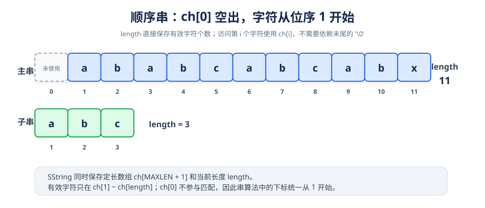
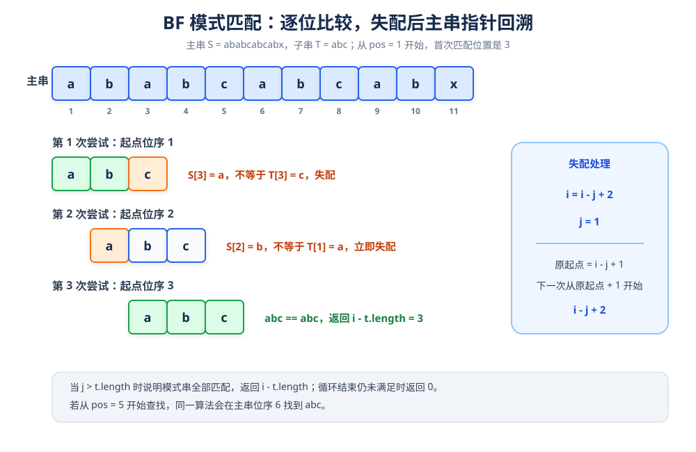

# 顺序串与 BF 模式匹配

> **一句话理解**：串是字符的有限序列；模式匹配就是在主串 `S` 中查找子串 `T` 第一次出现的位置。BF 算法从指定起点开始逐位比较，失配后把主串指针回退到下一个起点重新比较。

| 主串 `S` | 模式串 `T` | 起始位序 `pos` | 结果 |
|---|---|---|---|
| `ababcabcabx` | `abc` | `1` | 匹配位置 `3` |
| `ababcabcabx` | `abc` | `5` | 匹配位置 `6` |
| `ababcabcabx` | `amn` | `1` | 未找到，返回 `0` |

## 1. 顺序串的结构

顺序串使用一段连续的字符数组保存字符，并额外使用 `length` 记录当前串长。



```cpp
#define MAXLEN 255

//顺序串结构定义
typedef struct {
    char ch[MAXLEN + 1];
    int length;
}SString;
```

这里有两个关键约定：

- `ch[0]` 不使用，有效字符存放在 `ch[1]` 到 `ch[length]`。
- 串的位序从 `1` 开始，与 BF 算法中的 `i`、`j` 保持一致。
- `MAXLEN = 255` 表示最多保存 255 个有效字符。
- 由于已经保存 `length`，判断串长时不需要每次重新遍历字符数组。

## 2. 串赋值：StrAssign


```cpp
//串赋值操作
bool StrAssign(SString& s, const char* str) {
    int i;
    s.length = strlen(str); //cstring头文件里面的函数，求字符个数
    if (s.length > MAXLEN)  //赋值的字符串不可以超过最大长度
        return false;
    for (i = 1; i <= s.length; i++) {
        s.ch[i] = str[i - 1];  //顺序串字符从1开始，给的字符串下标第一个为0
    }
    return true;
}
```

`str` 是普通的 C 风格字符串，它的首字符下标为 `0`。赋值时执行关系：

```text
s.ch[1] = str[0]
s.ch[2] = str[1]
...
s.ch[length] = str[length - 1]
```

因此逻辑位序 `i` 与 C 字符串下标之间相差 `1`。

> `strlen` 要求输入字符串以 `'\0'` 结尾。`SString` 自身不依赖末尾的 `'\0'` 判断长度，而是直接使用 `length`。

## 3. 打印顺序串

```cpp
//打印顺序串
void PrintString(SString s) {
    for (int i = 1; i <= s.length; i++) {
        cout << s.ch[i] << endl;
    }
    cout << endl;
}
```

原程序的打印函数每输出一个字符就换一次行，因此完整测试的输出会逐字符纵向显示。算法的匹配结果不受打印形式影响。

## 4. BF 算法的核心过程

BF 也叫朴素模式匹配算法。设：

- i表示主串 s 当前要比较的位置。
- j 表示模式串 t当前要比较的位置。
- s.length = n，t.length = m。

算法从 i = pos、j = 1 开始。只要两个位置的字符相同，就让 i,j 同时向后移动。



当 s.ch[i] != t.ch[j] 时发生变化：

```text
当前尝试的起点 = i - j + 1
下一次尝试的起点 = 当前起点 + 1
新的 i = i - j + 2
新的 j = 1
```

例如第一次从位序 1 开始时，前两个字符 ab 匹配，第三个字符 a 与 c失配。算法不会保留已经匹配的 ab，而是退回主串位序 2，让j重新从1开始。

### 匹配成功

如果 j > t.length，说明模式串的每个字符都已经匹配：

```text
返回位置 = i - t.length
```

此时 i位于匹配区间之后，所以减去模式串长度就能得到首个匹配字符的位序。

### 匹配失败

如果主串已经走到末尾，但 j 仍未超过 t.length，说明不存在匹配，函数返回0。

## 5. BF 匹配函数

```cpp
//BF算法
int Index_BF(SString s, SString t, int pos) {
   int i = pos;
   int j = 1;
   while (i <= s.length && j <= t.length) {
       if (s.ch[i] == t.ch[j]) {
           ++i;
           ++j;
       }
       else {
           i = i -j + 2;
           j = 1;
       }
   }
   if (j > t.length)
       return i - t.length;
   else
       return 0;

}
```

### 为什么失配后是 i - j + 2

假设当前尝试从主串位序 start开始，那么比较到下标 i 时，已经检查了 j - 1 个字符：

```text
start + (j - 1) = i
```

所以：

```text
start = i - j + 1
nextStart = start + 1 = i - j + 2
```

这就是 BF 算法发生回溯的原因。它没有利用已经比较过的字符信息，因此最坏情况下会重复比较很多次。

## 6. 示例逐步分析

主串和模式串分别为：

```text
S = a b a b c a b c a b x
位序：1 2 3 4 5 6 7 8 9 10 11

T = a b c
位序：1 2 3
```

从 pos = 1 开始：

| 尝试起点 | 对齐结果 | 比较情况 | 结论 |
|---:|---|---|---|
| `1` | `aba` 与 `abc` | 第 3 位 `a != c` | 失配，起点移到 `2` |
| `2` | `bab` 与 `abc` | 第 1 位 `b != a` | 失配，起点移到 `3` |
| `3` | `abc` 与 `abc` | 3 个字符全部相等 | 返回 `3` |

从 pos = 5 开始时，主串在第一次比较中会跳过前面的内容，最终在位序 6 找到一个完整的 abc。

## 7. 完整测试代码

> 下面的完整代码保留原程序中的关键注释，并修正第二处输出提示：实际调用的起点是 pos = 5。

```cpp
#include <iostream>
#include <cstring>

using namespace std;

#define MAXLEN 255

//顺序串结构定义
typedef struct {
    char ch[MAXLEN + 1];
    int length;
}SString;

//串赋值操作
bool StrAssign(SString& s, const char* str) {
    int i;
    s.length = strlen(str); //cstring头文件里面的函数，求字符个数
    if (s.length > MAXLEN)  //赋值的字符串不可以超过最大长度
        return false;
    for (i = 1; i <= s.length; i++) {
        s.ch[i] = str[i - 1];  //顺序串字符从1开始，给的字符串下标第一个为0
    }
    return true;
}

//打印顺序串
void PrintString(SString s) {
    for (int i = 1; i <= s.length; i++) {
        cout << s.ch[i] << endl;
    }
    cout << endl;
}

//BF算法
int Index_BF(SString s, SString t, int pos) {
    int i = pos;
    int j = 1;

    while (i <= s.length && j <= t.length) {
        if (s.ch[i] == t.ch[j]) {
            ++i;
            ++j;
        }
        else {
            i = i - j + 2;
            j = 1;
        }
    }

    if (j > t.length)
        return i - t.length;
    else
        return 0;
}

int main() {
    SString s, t, k;

    StrAssign(s, "ababcabcabx");
    StrAssign(t, "abc");

    cout << "主串：" << endl;
    PrintString(s);

    cout << "子串：" << endl;
    PrintString(t);

    int res1 = Index_BF(s, t, 1);
    if (res1 != 0)
        cout << "从pos=1开始查找，匹配位置：" << res1 << endl;
    else
        cout << "未找到" << endl;

    int res2 = Index_BF(s, t, 5);
    if (res2 != 0)
        cout << "从pos=5开始查找，匹配位置：" << res2 << endl;
    else
        cout << "未找到" << endl;

    //找不到测试
    StrAssign(k, "amn");
    int res3 = Index_BF(s, k, 1);
    if (res3 != 0)
        cout << "从pos=1开始查找，匹配位置：" << res3 << endl;
    else
        cout << "未找到" << endl;

    return 0;
}
```

## 8. 正确性说明

可以把每一轮比较看成一个待验证的起点：

1. 如果 j 从 1 增长到 m + 1，说明以当前起点开头的连续 m 个字符全部相等，返回位置正确。
2. 如果中途失配，说明当前起点不可能匹配；i = i - j + 2 恰好让下一轮从当前起点的下一个位序开始。
3. 算法会依次检查所有可能起点，因此只要主串中存在模式串，就一定会在首次匹配时返回正确位置。
4. 如果所有合法起点都检查完仍没有匹配，返回 0，表示未找到。

## 9. 复杂度

设主串长度为 n，模式串长度为 m。

| 指标 | 结果 | 原因 |
|---|---:|---|
| 最好时间复杂度 | O(m) | 从起点开始连续匹配 m 个字符 |
| 最坏时间复杂度 | O(nm)| 每个起点都可能重复比较大量字符 |
| 空间复杂度 | O(1) | 只使用 i、j 等固定数量变量 |

BF 算法的优点是实现简单、容易理解；缺点是失配后主串指针需要回溯，可能进行大量重复比较。KMP 算法通过 next 数组保存模式串自身的前后缀信息，可以把时间复杂度降到 O(n + m)。

## 10. 易错点清单

- `SString` 从位序 `1` 开始保存字符，`ch[0]` 不参与匹配。
- 失配回溯公式是 `i = i - j + 2`，不是 `i = i - j + 1`。
- 匹配成功后返回的是 `i - t.length`，不是当前的 `i`。
- 未找到时返回 `0`，调用者不能把 `0` 当作合法匹配位置。
- 入口参数 `pos` 应当位于合法范围内，否则需要在调用 `Index_BF` 前额外检查。
- `StrAssign` 使用 `strlen`，输入字符串必须以 `'\0'` 结尾。
- 若模式串长度大于主串剩余长度，BF 仍会逐轮判断；实现更严谨时可以提前判断剩余长度，减少无效尝试。
